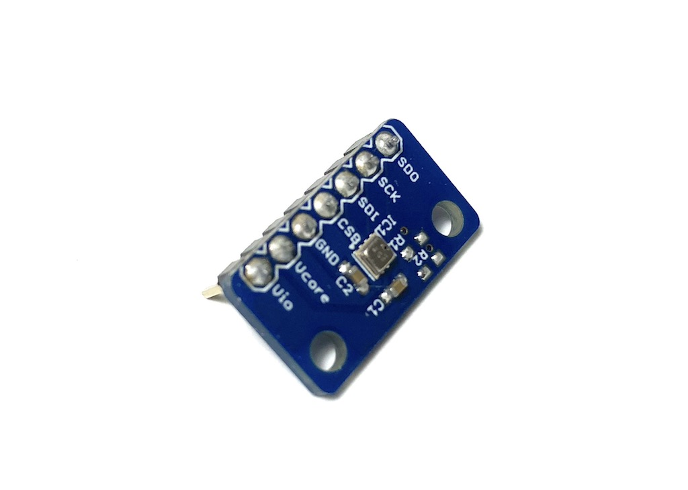
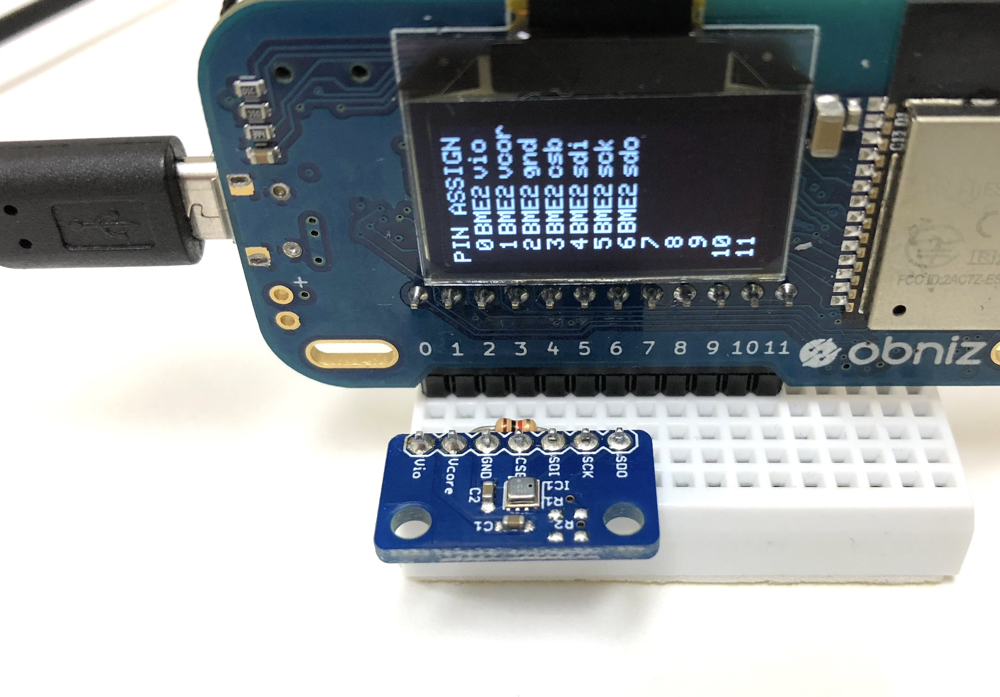
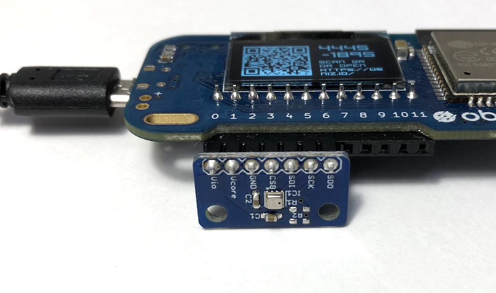

# 温度センサー - BME280
温度、湿度、気圧センサーです。
とても低い消費電力で、かつ高い精度で計測できます。



## wired(obniz,  {[vio, vcore, gnd, csb, sdi, sck, sdo, address, i2c]} )

センサーをobnizにつなぎます。
obnizには内部プルアップがありますが、安定した通信のためには外部の抵抗を使ってSCKとSDIをvioなどにプルアップして下さい。



##### 以下のような直接接続はおすすめできません



name | type | required | default | description
--- | --- | --- | --- | ---
vio | `number(obniz io)` | no | &nbsp | connected obniz io. power supply for interface
vcore | `number(obniz io)` | no | &nbsp | connected obniz io. power supply for core
gnd | `number(obniz io)` | no | &nbsp | connected obniz io. power supply
csb | `number(obniz io)` | no | &nbsp | connected obniz io. I2C/SPI 選択.
sdi | `number(obniz io)` | no | &nbsp | connected obniz io. データ端子
sck | `number(obniz io)` | no | &nbsp | connected obniz io. クロック
sdo | `number(obniz io)` | no | &nbsp | connected obniz io. データ通信かアドレス選択
i2c | `i2c object` | no | &nbsp | configured i2c object
address | `number` | no | 0x76  | 0x76 or 0x77

このライブラリではI2Cで部品と通信します。

```Python
# Python Example
# Please pullup sdi and sck.
bme280 = obniz.wired(
    "BME280",
    {"vio": 0, "vcore": 1, "gnd": 2, "csb" 3, "sdi": 4, "sck": 5, "sdo":6}
)
await bme280.apply_calibration()
val = await bme280.get_all_wait()
print(val)
```

vioとvcoreは直接繋げられます。
csbはhighに単純に繋げられ、sdoもgndに単純に繋げられます。
なので、そのように繋いだものをobnizにつなぐときの最小構成は以下になります。


```Python
# Python Example

# vcore connected to vio
# csb connected to vio
# sdo connected to gnd

bme280 = obniz.wired("BME280", {"vio": 0, "gnd": 1, "sdi": 2, "sck": 3})
await bme280.apply_calibration()
val = await bme280.get_all_wait()
print(val)
```

またはI2Cオブジェクトで設定することで他のI2C接続の部品とバスを共有できます。

```Python
# Python Example

i2c = obniz.get_free_i2c()
i2c.start({"mode": "master", "sda": 2, "scl": 3, "clock" 100000}) 

bme280 = obniz.wired("BME280", {"vio": 0, "gnd": 1, "i2c": i2c})
```

もしチップをsdoをプルアップすることでアドレスを 0x77にしている場合は

```Python
# Python Example

bme280 = obniz.wired(
    "BME280",
    {"vio": 0, "gnd": 1, "sdi": 2, "sck": 3, "address": 0x77}
)
```

## [await] apply_calibration()

チップに保存されている工場で設定されているキャリブレーションデータを取り出します。
これをしないで使うことも出来ますが、これを一度呼び出すことで精度がかなり上がります。

```Python
# Python Example
# Please pullup sdi and sck.
bme280 = obniz.wired(
    "BME280",
    {"vio": 0, "vcore": 1, "gnd": 2, "csb" 3, "sdi": 4, "sck": 5, "sdo":6}
)
await bme280.apply_calibration()
```

## [await] set_iir_strength()

内蔵IIRフィルタの強度を変更できます。 0 to 4.

0 で使わない設定となります（デフォルト）

IIRフィルタは計測結果を安定させてより高い精度にします。
ただし、そのためには結果が出るのをしばらく待つ必要があります。


```Python
# Python Example
# Please pullup sdi and sck.
bme280 = obniz.wired(
    "BME280",
    {"vio": 0, "vcore": 1, "gnd": 2, "csb" 3, "sdi": 4, "sck": 5, "sdo":6}
)
await bme280.apply_calibration()
await bme280.set_iir_strength(1) # start using minimum IIR 
```

## [await] get_all_wait()

すべての値を取得します。

- temperature: セルシウス温度
- humidity: %
- pressure: hPa

```Python
# Python Example
# Please pullup sdi and sck.
bme280 = obniz.wired(
    "BME280",
    {"vio": 0, "vcore": 1, "gnd": 2, "csb" 3, "sdi": 4, "sck": 5, "sdo":6}
)
await bme280.apply_calibration()
obj = await bme280.get_all_wait()
print('temp:', obj.temperature, 'degree')
print('humidity:', obj.humidity, '%')
print('pressure:', obj.pressure, 'hPa')
```

## calc_altitude(pressure, sea_pressure)

気圧から高度を計算するUtility関数です。返り値はメートルでとなります。

```Python
# Python Example
# Please pullup sdi and sck.
bme280 = obniz.wired(
    "BME280",
    {"vio": 0, "vcore": 1, "gnd": 2, "csb" 3, "sdi": 4, "sck": 5, "sdo":6}
)
await bme280.apply_calibration()
obj = await bme280.get_all_wait()
air_pressure = obj.pressure
hight_in_m = bme280.calc_altitude(air_pressure)
print('altitude:', hight_in_m, 'm')
```